# 🥋 Mundo JJ
Site dedicado ao ensino e divulgação do Jiu-Jitsu, trazendo técnicas e novidades do universo da luta.

---

## 👤 Dados do Aluno
- **Aluno:** Luiz Felipe de Souza Damasceno
- **Curso:** Sistemas de Informação
- **Turma:** Noite
- **Matrícula:** 1651358

---

## 📄 Descrição do Projeto
O Mundo JJ é uma plataforma acadêmica dedicada ao ensino e divulgação do Jiu-Jitsu. O site apresenta técnicas da arte marcial de forma dinâmica, com informações detalhadas sobre cada uma delas.

O projeto foi desenvolvido com HTML, CSS, Bootstrap e JavaScript puro. Os dados são persistidos em um arquivo `db.json` e expostos via **JSON Server** como uma API REST. A interface consome essa API dinamicamente para exibir, cadastrar, editar e excluir técnicas.

---

## ✨ Funcionalidades
- 🎠 Carrossel de técnicas em destaque
- 📋 Cards com todas as técnicas cadastradas
- 🔍 Pesquisa/filtro de técnicas por nome ou descrição
- 📊 Dashboard com gráficos (Chart.js)
- 🔐 Login e cadastro de usuários
- ❤️ Sistema de favoritos por usuário logado
- 🛠️ CRUD completo de técnicas (apenas administradores)
- 📱 Layout responsivo para mobile e desktop

---

## 🖥️ Telas do Projeto

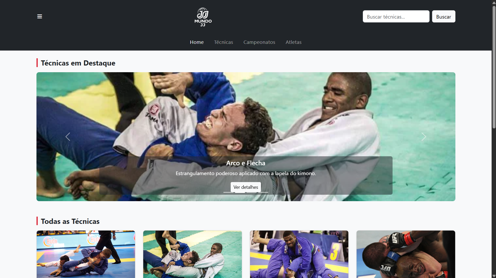
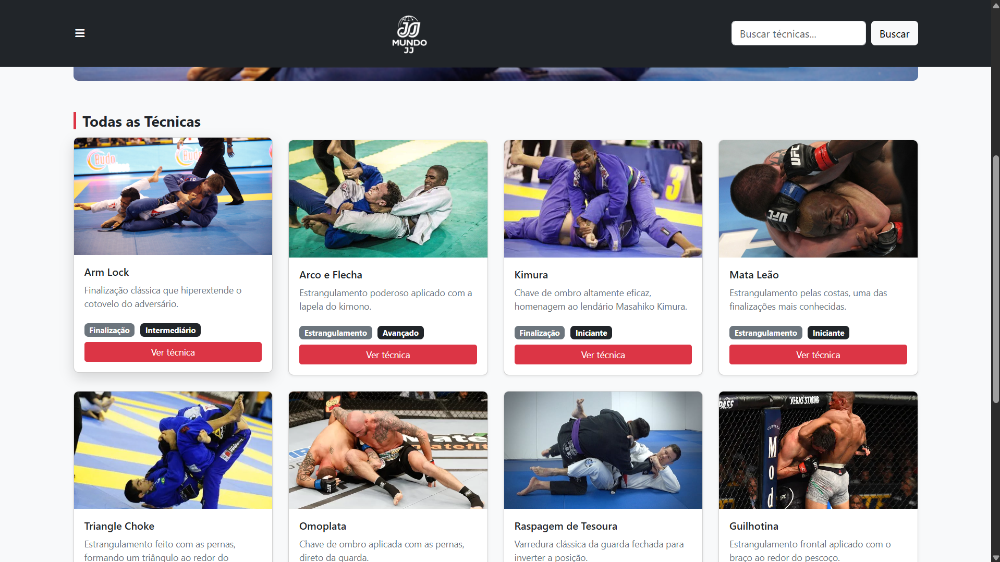
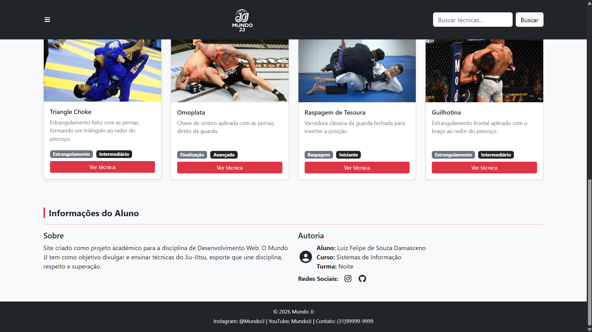
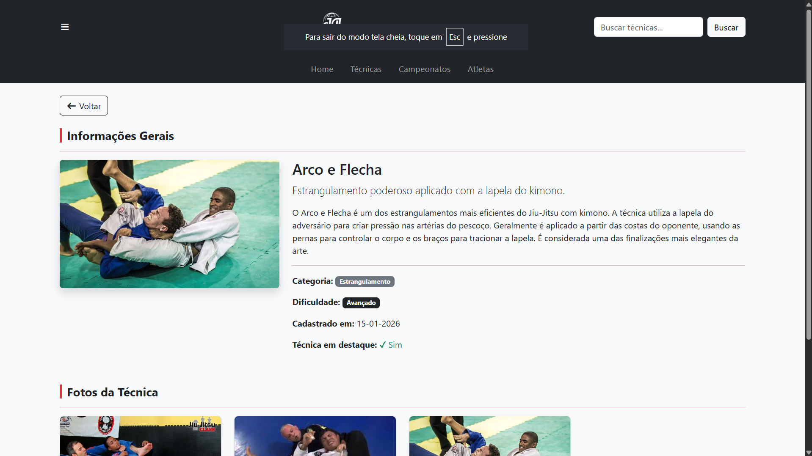
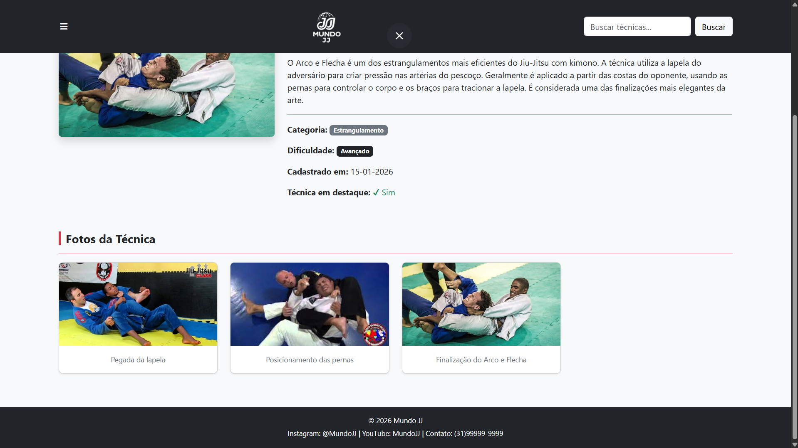
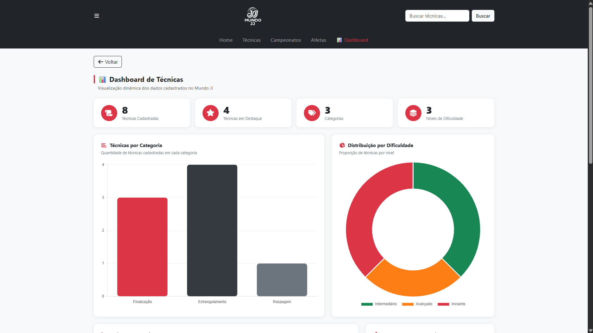
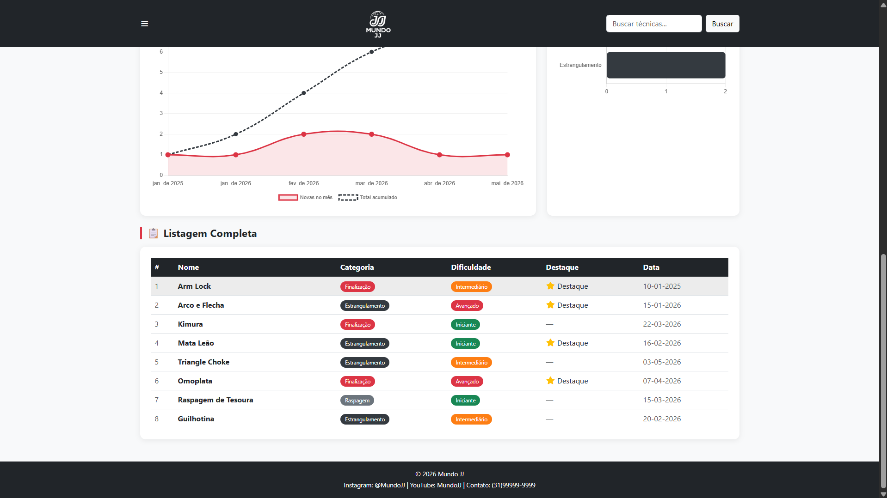
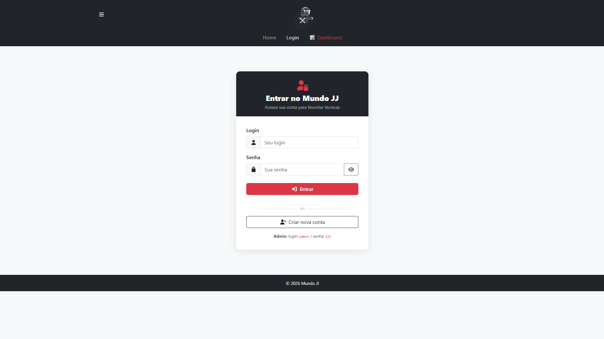
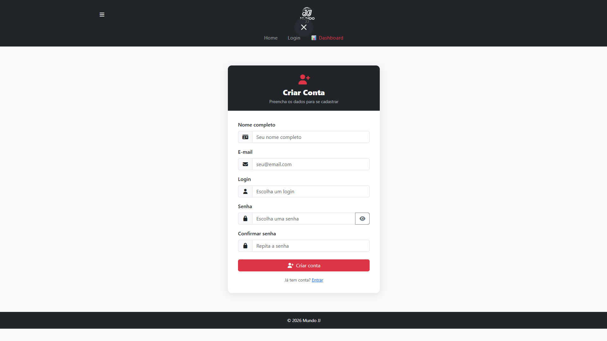
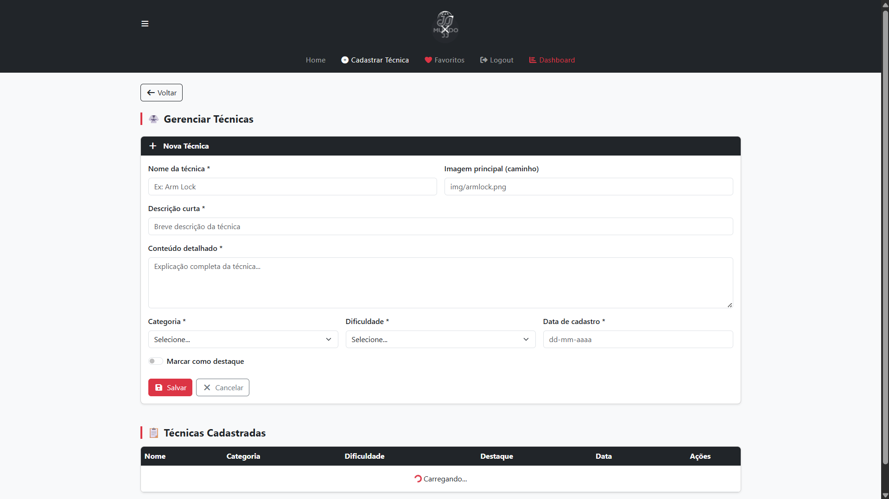
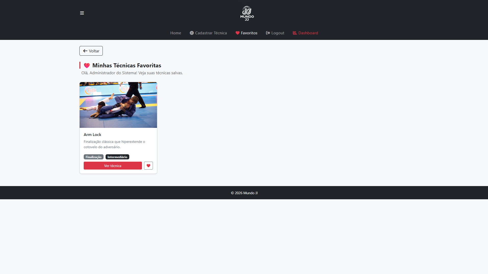
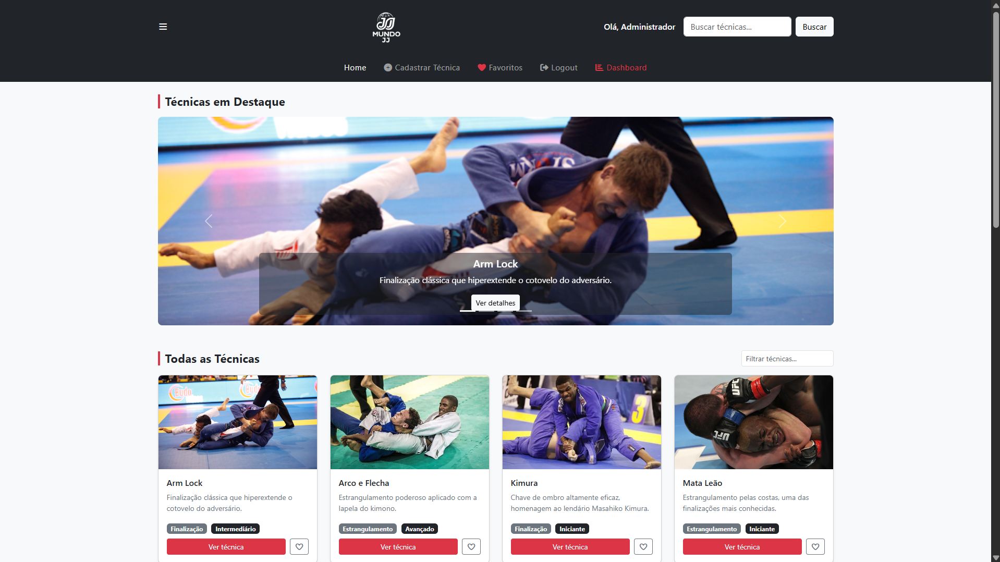
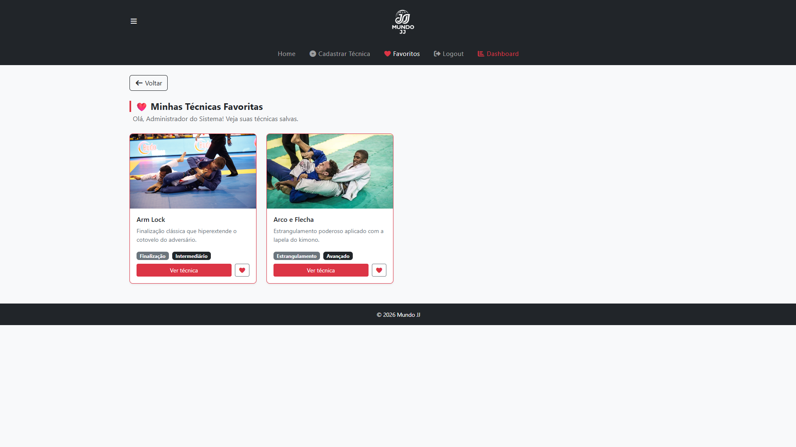
---

## 🚀 Como executar

### Pré-requisitos
- [Node.js](https://nodejs.org/) instalado

### Passo a passo

1. Clone o repositório:
```bash
git clone <URL_DO_REPOSITORIO>
cd Meu-projeto
```

2. Instale as dependências:
```bash
npm install
```

3. Inicie o servidor:
```bash
npm start
```

4. Acesse no navegador pelo Live Server do VS Code:
```
http://127.0.0.1:5502
```

> ⚠️ O JSON Server precisa estar rodando (`npm start`) para o site funcionar.

### Usuários padrão
| Login | Senha | Perfil |
|-------|-------|--------|
| admin | 123   | Administrador |
| user  | 123   | Usuário comum |

---

## 🗂️ Estrutura do Projeto
```
MEU-PROJETO/
├── db/
│   └── db.json              ← Banco de dados JSON
├── public/
│   ├── img/                 ← Imagens das técnicas
│   ├── app.js               ← Lógica principal
│   ├── index.html           ← Home page
│   ├── detalhe.html         ← Detalhes da técnica
│   ├── dashboard.html       ← Gráficos e estatísticas
│   ├── login.html           ← Login de usuário
│   ├── cadastro-usuario.html← Cadastro de novo usuário
│   ├── favoritos.html       ← Técnicas favoritas
│   ├── cadastro-itens.html  ← CRUD de técnicas (admin)
│   └── styles.css           ← Estilos personalizados
├── server.js                ← Servidor com CORS
├── package.json
└── json-server.json
```

---

## 📦 Estrutura do banco de dados (db.json)

```json
{
  "tecnicas": [
    {
      "id": "1",
      "nome": "Arm Lock",
      "descricao": "Finalização clássica que hiperextende o cotovelo do adversário.",
      "categoria": "Finalização",
      "dificuldade": "Intermediário",
      "destaque": true,
      "data": "10-01-2025",
      "imagem_principal": "img/armlock.png",
      "fotos": []
    }
  ],
  "usuarios": [
    {
      "id": "1",
      "login": "admin",
      "senha": "123",
      "nome": "Administrador do Sistema",
      "email": "admin@mundojj.com",
      "admin": true
    }
  ],
  "favoritos": []
}
```

---

## 🛠️ Tecnologias utilizadas
- HTML5
- CSS3
- JavaScript (puro, sem frameworks)
- Bootstrap 5
- Font Awesome
- Chart.js
- JSON Server
- Node.js